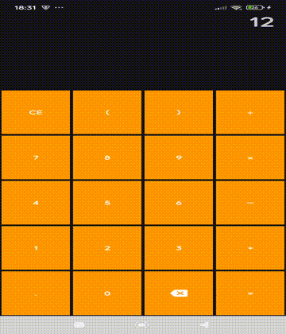

# SimpleKotlinCalculator

Uma aplicação simples de **calculadora em Kotlin** para Android 📱 que permite realizar operações 
básicas de soma, subtração, multiplicação e divisão.

---

## 📱 Demonstração




## 🚀 Funcionalidades

- 📌 Adição
- 📌 Subtração
- 📌 Multiplicação
- 📌 Divisão

---

## 📦 Tecnologias

O projeto foi construído utilizando:

- 🧪 **Kotlin**
- 🛠 **Android Studio**
- 📱 SDK Android
- 🧱 Estrutura de projeto padrão do Gradle

---

## 📝 Como rodar o projeto

1. Clone este repositório
   ```bash
   git clone https://github.com/RenanLM/SimpleKotlinCalculator.git

2. Abra a pasta do projeto no **Android Studio**
    - Selecione a opção **Open**
    - Navegue até a pasta clonada `SimpleKotlinCalculator`
    - Clique em **OK**

3. Aguarde a sincronização do Gradle
    - O Android Studio irá baixar automaticamente as dependências do projeto
    - Aguarde até que a mensagem **“Gradle Sync Finished”** apareça

4. Configure um dispositivo para execução
    - Conecte um dispositivo Android via USB **ou**
    - Crie um emulador em **Device Manager**

5. Execute a aplicação
    - Clique no botão **Run (▶)** no Android Studio
    - Escolha o dispositivo configurado
    - Aguarde a instalação e inicialização do app

---

## 📌 Observações

- Certifique-se de que o **Android SDK** esteja corretamente configurado
- Caso ocorra algum erro de sincronização, tente:
    - `File > Sync Project with Gradle Files`
    - Verificar a versão do Gradle e do SDK

---

## 🧪 Objetivo Educacional

Este projeto foi desenvolvido com fins educacionais, sendo ideal para:
- Aprender **Kotlin básico**
- Compreender a estrutura de um projeto Android
- Praticar lógica de programação
- Realizar operações matemáticas simples em uma interface gráfica

---

## 👤 Autor

**Renan Lucas de Moura**  
Estudante de Engenharia de Computação

🔗 GitHub: [https://github.com/RenanLM](https://github.com/RenanLM)

---

## ⭐ Considerações Finais

Se este projeto foi útil para você, considere deixar uma ⭐ no repositório.  
Sugestões e melhorias são sempre bem-vindas!
